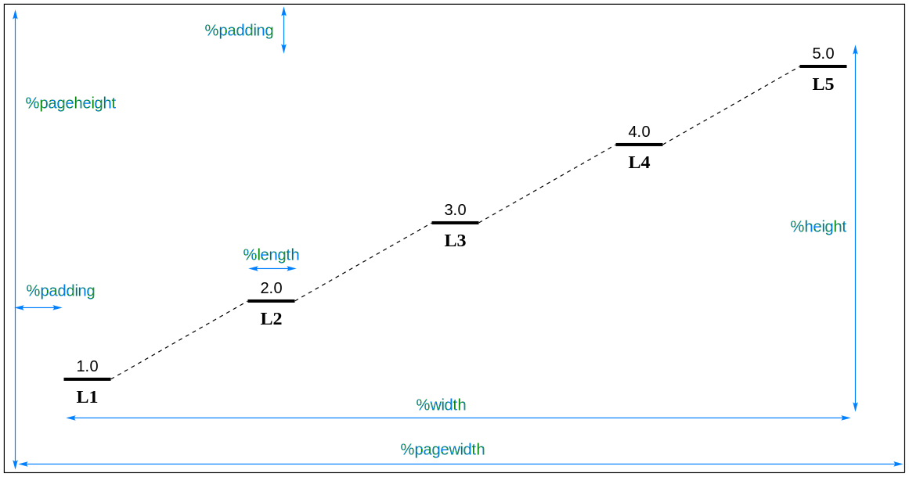

# EnergyDiagramDraw

## About

EnergyDiagramDraw is a ready-to-use energy diagram drawing program written in Python.

## Requires

- Python 3.9
- ChemDraw (for diagram viewing)

## Usage

You have the flexibility to specify both the input and output file names.
For the input file, the file extension can be anything (using `.edf`, represented `EnergyDiagramFile`, is recommended).
However, for the output file, the extension must be `.cdxml`.
If you choose not to provide an output filename, the program will automatically change the input file’s extension
from `.edf` to `.cdxml` (for other input file extensions, it will directly append `.cdxml`).

Assuming the input file is `INPUT.edf`, you can execute the following command to generate energy diagram.
For certain systems, you might need to replace `python` with `python3`.

```shell
python EnergyDiagramDraw.py INPUT.edf
python EnergyDiagramDraw.py INPUT.edf OUTPUT.cdxml
```

## Structure of `.edf` file

A `.edf` file contains three parts: `preamble` , `settings, data & labels` and `comments`.

```edf
preamble - optional, starts with '%', used to set the property of diagram
[blank line]
#settings - optional, starts with '#' and writes in one line
data
labels - optional
[blank line] - for more data, just repeat this part
#settingA settingB ...
data
labels - optional
[blank line]
[blank line] - program will stop parsing at here
comments - you can write anything you like here
```

### Preamble

Preamble can change property of diagram.
Each preamble statement must be written on a separate line and start with a `%`.
You can write them in any order, and omitted preamble statements will use default values.

| Long format    | Short format | Default value | Note                                                                                      |
|----------------|--------------|---------------|-------------------------------------------------------------------------------------------|
| %width=        | %w=          | 400           | Set the width of diagram                                                                  |
| %height=       | %h=          | 300           | Set the height of diagram                                                                 |
| %length=       | %l=          | 30            | Set the length of energy line                                                             |
| %padding       | %pd=         | 40            | Set the padding of diagram                                                                |
| %pagewidth=    | %pw=         | 540           | Set the width of page<br/>This value will be ignored if less than (width + 2 * padding)   |
| %pageheight=   | %ph=         | 720           | Set the height of page<br/>This value will be ignored if less than (height + 2 * padding) |
| %resetsettings | %reset       |               | Reset settings for each dataset                                                           |



### Settings, Data and labels

Settings line start with a `#`, and all settings are written on the same line, separated by spaces.
Setting lines are optional, so you can either omit this line entirely or simply write a `#`.
The specific settings are as follows.

| Setting    | Allowed values | Default | Note                   |
|------------|----------------|---------|------------------------|
| decimal=   | 0-9            | 1       | Set the decimal places |
| numberfont | normal/bold    | normal  | Set the number font    |
| labelfont  | normal/bold    | bold    | Set the label font     |

Settings that do not appear in the setting statement remains unchanged.
In other words, each setting will apply to all subsequent datasets.
This behavior can be altered by preamble statement `%reset`.

The line after setting statement consists of data separated by commas.
And the next line represents labels (which are optional).
You can also add spaces or tabs to align.
In either the data or label lines, you can leave empty spaces to skip certain points.
However, it’s essential to ensure that the number of labels corresponds exactly to the number of data points.

You can repeat this part if you want to draw more data in one diagram.
Remember to separate with blank lines.

### Comments part

You can use two consecutive blank lines to mark the end position.
The content after that will be ignored by the program and can be used to write comments, etc.
If there is no additional content, you can even omit two blank lines.

## Simplest example

The simplest `.edf` file contains only data. Like this:

```edf
1.0,2.0,3.0,4.0,5.0
```

For more examples, please see the files in `examples` folder.

## Author

Zihan Lin @ USTC

linzihan322@mail.ustc.edu.cn