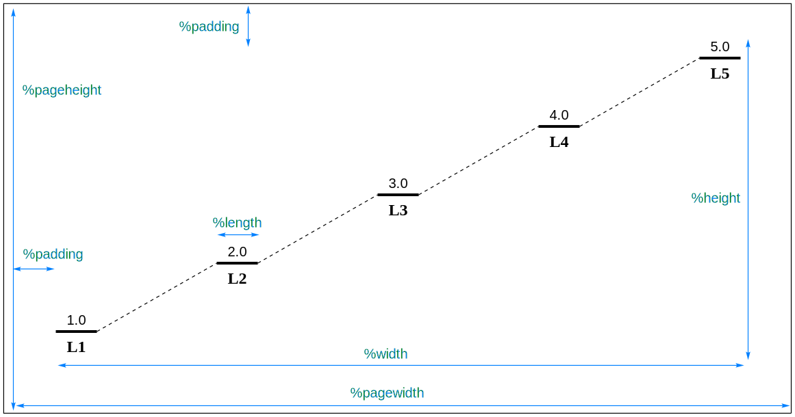

# EnergyDiagramDraw

## 关于

EnergyDiagramDraw 是一个python写的开箱即用的能量图绘制软件。

## 需求

- Python 3.9
- ChemDraw （查看结果需要）

## 使用方法

你可以自定义输入和输出文件名。
对于输入文件，文件后缀名可以任意（但强烈建议使用`.edf`，表示EnergyDiagramFile）；但输出文件的后缀名必须为`.cdxml`。
如果输出文件名被省略，则程序自动将输入文件后缀名由`.edf`更改为`.cdxml`作为输出文件名（对于其他后缀名，则直接在后面加上`.cdxml`）。

假设输入文件为`INPUT.edf`，你可以执行以下命令生成能量图。注意：对于某些系统，你可能需要将`python`替换为`python3`。

```shell
python EnergyDiagramDraw.py INPUT.edf
python EnergyDiagramDraw.py INPUT.edf OUTPUT.cdxml
```

## `.edf`文件的结构

一个完整的`.edf`文件包含三个部分：`序言区`，`设置、数据和标签`以及`注释部分`。

```edf
序言区 - 可选，由“%”起始，用来设置图的整体属性
[空行]
#设置行 - 可选，由“#”起始，用来改变每个数据集绘图设置
数据行
标签行 - 可选
[空行] - 如果你有更多的数据，只需要重复这个部分
#设置行
数据行
标签行 - 可选
[空行]
[空行] - 程序会在这里停止解析
注释部分 - 你可以在这写任何内容
```

### 序言区

序言可以改变图的整体属性。
每个序言语句由`%`起始，并单独成一行。
你可以以任意顺序来写一条或多条序言语句，而被省略的序言语句将使用默认值。

| 长格式            | 短格式    | 默认值 | 注释                                              |
|----------------|--------|-----|-------------------------------------------------|
| %width=        | %w=    | 400 | 设置图的宽度                                          |
| %height=       | %h=    | 300 | 设置图的高度                                          |
| %length=       | %l=    | 30  | 设置能量线的长度                                        |
| %padding       | %pd=   | 40  | 设置图到页面边缘的距离                                     |
| %pagewidth=    | %pw=   | 540 | 设置页面宽度<br/>注意这个值比(width + 2 * padding)小的时候将被忽略  |
| %pageheight=   | %ph=   | 720 | 设置页面高度<br/>注意这个值比(height + 2 * padding)小的时候将被忽略 |
| %resetsettings | %reset |     | 为每个数据集重置设置                                      |



### 设置，数据和标签

设置行由`#`起始，所有设置项写在一行之中，并用空格隔开。
设置行是可选的，你可以直接省略这一行，或者简单的只写一个`#`。
以下是具体的设置项：

| 设置项        | 允许的取值       | 默认值    | 注释             |
|------------|-------------|--------|----------------|
| decimal=   | 0-9         | 1      | 设置图上显示的小数位数    |
| numberfont | normal/bold | normal | 设置数字的字体（正常或粗体） |
| labelfont  | normal/bold | bold   | 设置标签的字体（正常或粗体） |

未出现的设置项将保持不变，即会继承之前的设置。
你可以在序言区写上`%reset`来改变这一行为。

设置行之后的一行是数据行，数据之间用逗号隔开。
为了对齐，你也可以加入空格或制表符。
再下面一行是可选的标签行。
无论是数据行还是标签行，你都可以留空来跳过一些点。
但是你必须保证数据和标签一一对应，数量一致（包括留空的点）。

如果你有更多的数据想绘制在同一张图中，只需要空一行，再重复这个部分即可。

### 注释部分

你可以用两个连续的空行来标记结束位置。
在这之后的内容将被程序忽略，因此你可以在这里写任何你想写的内容，比如对这个文件的注释。
如果你不打算写任何内容，你甚至可以省略那两个空行。

## 最简单的例子

最简单的`.edf`文件只有一行，只包含数据:

```edf
1.0,2.0,3.0,4.0,5.0
```

更多例子请查看`examples`文件夹中的文件。

## 作者

Zihan Lin @ USTC

linzihan322@mail.ustc.edu.cn